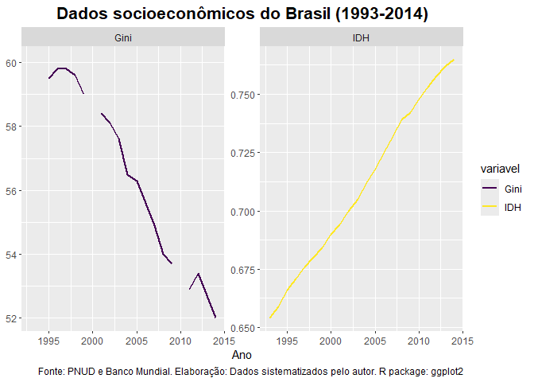
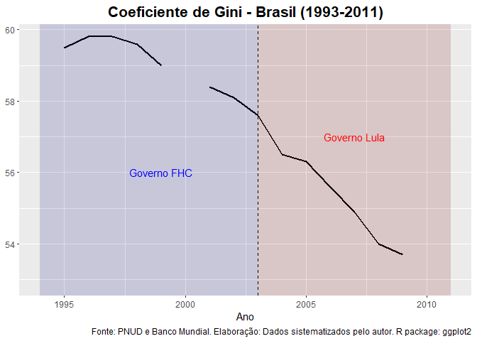
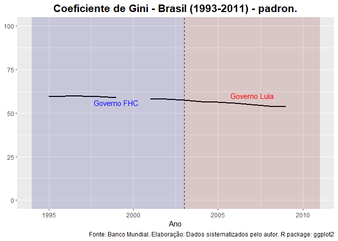
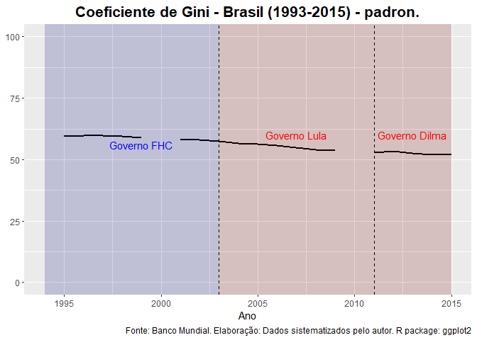
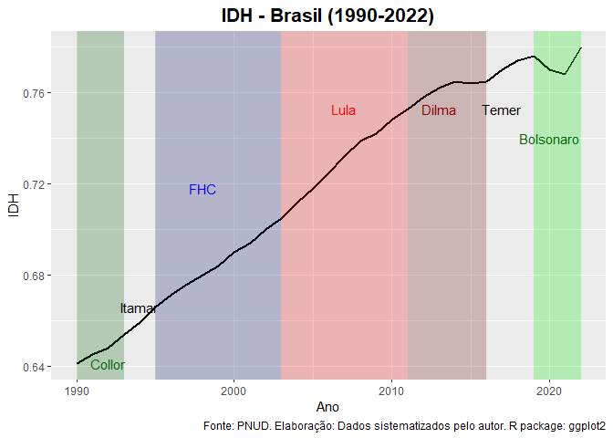
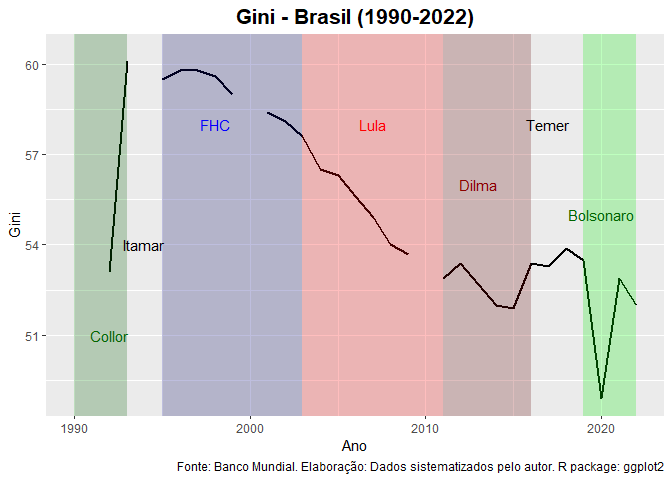
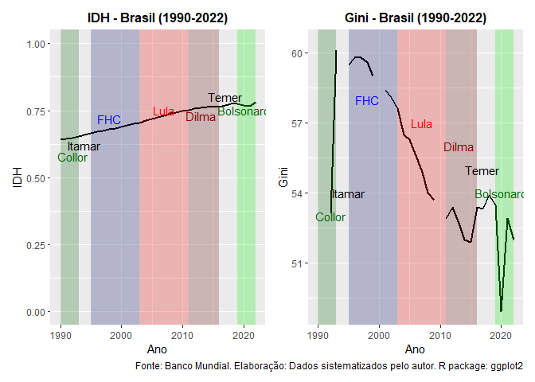
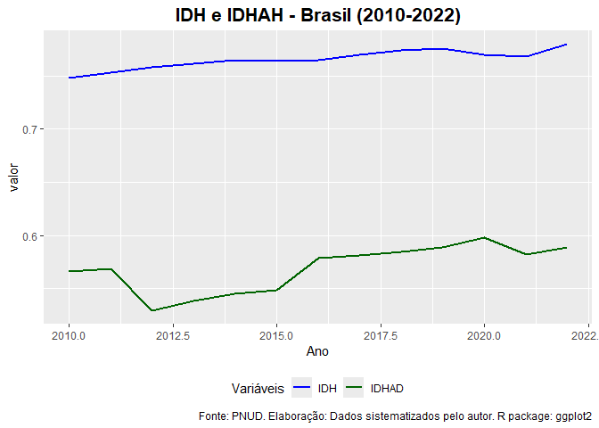

Qualidade de vida no Brasil (1990-2022)
================
Diego Prata Melo
2025-05-23

# Introdução

Esta peça é o trabalho de conclusão do curso Ciência de Dados com R do
IBPAD. Seu propósito é apresentar a evolução dos indíces de qualidade de
vida no Brasil no período entre 1990 e 2022. Os dados apresentados aqui
corroboram com o argumento de Marta Arretche de que a Constituição de
1988 promoveu uma transição democrática bem-sucedida, pois promoveu
fortes mudanças nas políticas sociais responsáveis por incluir setores
anteriormente excluídos. “Esse mecanismo não apenas reduziu
desigualdades, mas também operou como um contrapeso aos efeitos da crise
econômica que atravessamos” [^1].

No tocante ao bem-estar socioeconômico, foram usados indicadores que
tratam da desigualdade e da qualidade de vida: o Coeficiente de Gini e o
Índice de Desenvolvimento Humano (IDH) [^2], respectivamente. Também foi
usado o recentemente elaborado Índice de Desenvolvimento Humano Ajustado
à Desigualdade (IDHAD), que considera as três dimensões do IDH à luz da
desigualdade. Esse indicador possui dados a partir de 2010.

As informações foram retiradas das plataformas do Programa das Nações
Unidas para o Desenvolvimento (PNUD) - no caso do IDH e do IDHAD - e do
Banco Mundial (World Bank) - no caso do Gini.

# Operacionalização

## Importando pacotes

O presente relatório foi escrito com RMarkdown. Sendo assim, para
realizar as análises, precisamos carregar os pacotes que serão usados na
sessão.

``` r
library(tidyverse)
library(readr)
library(data.table)
library(flextable)
library(gt)
library(WDI)
library(patchwork)
library(shinyjs)
library(scales)

options(scipen = 999)
```

## Importando dados

Agora que temos nossos dados devidamente importados, podemos carregar os
dados que usaremos em nossa apresentação. No caso dos dados do PNUD, o
arquivo foi baixado do site da organização, que pode ser acessado
clicando na imagem abaixo:

<div style="text-align: center;">

<a href="https://hdr.undp.org/data-center/documentation-and-downloads">
 </a>

</div>

Após baixar o arquivo, é só importar a base de dados com o seguinte
comando:

``` r
HDR2025 <- read_csv("HDR25_Composite_indices_complete_time_series.csv")
```

Quanto ao Gini, importamos os dados usando o API do Banco Mundial. Para
tanto, é necessário instalar o pacote “WDI” e depois executá-lo:

``` r
install.packages("WDI")
library(WDI)
```

Caso prefira acessar os dados diretamente do site, clique na imagem
abaixo:

<div style="text-align: center;">

<a href="https://data.worldbank.org/indicator/SI.POV.GINI?end=2022&start=1963&view=chart">

</a>

</div>

## Tratamento dos dados

Após baixar os dados, faz-se necessário realizar seu tratamento. No
entanto, para deixar o texto corrente mais “limpo”, preferimos deixar os
comandos de tratamento no Apêndice, localizado no final deste trabalho.

# Analisando o caso brasileiro

A “Nova República” brasileira (1985 -) se inicia após vinte anos de
regime civil-militar. Seu momento fundacional foi a Assembleia
Constituinte, que promulgou a Constituição de 1988, cujo teor fortemente
social e democrático rendeu-lhe a alcunha de “Constituição Cidadã”. A
prevalência de grupos progressistas em diversos temas nos trabalhos
constituintes permitiu que direitos importantes fossem incluídos na
Carta, como a universalização da saúde, o direito à assistência social
em direito e incentivos para processos de participação social [^3].

A nova democracia ainda passaria por um período conturbado marcado pela
hiperinflação (herdada pelo regime autoritário), por demonstrações do
poder de facto dos militares durante o processo constituinte – que se
valeram de ameaças e lobby para manter sua autonomia perante os civis
[^4] – e pelo impeachment do presidente Fernando Collor de Mello em
1992.

Apesar das turbulências que marcaram o começo da redemocratização, houve
avanços nos indicadores socioeconômicos do Brasil nesse período, graças,
em parte, às garantias básicas fornecidas pela Constituição de 1988.
Segundo o Programa das Nações Unidas para o Desenvolvimento (PNUD), o
Índice de Desenvolvimento Humano (IDH) saltou de 0.610 em 1990 para
0.630 em 1993.

Já o Gini do país, nesse período entre 1990 e 1993, passou por
oscilações, caindo em 1992 e subindo novamente em 1993.

|  Ano |   IDH | Gini |
|-----:|------:|-----:|
| 1990 | 0.641 | 60.4 |
| 1991 | 0.645 |   NA |
| 1992 | 0.648 | 53.1 |
| 1993 | 0.654 | 60.1 |

A partir de 1994, parecia que o sistema político brasileiro conseguiria
se estabilizar. As coalizões políticas lideradas pelo Partido dos
Trabalhadores (PT) e pelo Partido da Social Democracia Brasileira (PSDB)
protagonizaram e estabilizaram a disputa política dentro dos limites das
“grades de proteção” da democracia [^5].

No plano social, o IDH brasileiro continuou em ascensão nesse período:
de 0,63 em 1993 até 0,75 em 2014. Por sua vez, o coeficiente de Gini do
país caiu de 60.1 em 1993 para 52 em 2014, em um movimento de queda
contínua com pequenos intervalos de subida em apenas dois anos (1996 e
2012)



Tal período de estabilidade provocou uma importante redução da
desigualdade social. O gráfico mostra a queda do Gini nos Governos FHC
(PSDB) e Lula (PT), sendo ela um pouco mais proeminente no governo
petista.



O gráfico abaixo mostra essa mesma queda ao ajustar a escala para o
padrão (de 0 a 100)



O processo continuou no primeiro mandato de Dilma Rousseff (2011-2015).



A partir de 2015, o país conheceu um forte momento de instabilidade, com
crises econômicas e política [^6]. No entanto, mesmo em um ambiente
adverso, os efeitos da Constituição de 1988 continuaram em vigor. No
caso do IDH, o Brasil manteve a tendência de crescimento, realidade
presente desde o início da série histórica do indicador (1990). Essa
subida significativa foi interrompida apenas por pequenos momentos de
queda. A oscilação negativa mais forte ocorre durante o Governo
Bolsonaro, seguida por uma recuperação no fim de seu governo.

Observe a trajetória do IDH em todos os governos pós-democratização.



O coeficiente de Gini brasileiro, por sua vez, passa por algumas
oscilações, passando, inclusive, por algum retorno à desigualdade. Um
caso curioso é o do Governo Bolsonaro, no qual ocorreu uma queda
vertiginosa em 2020, um forte retorno em 2021 e um novo declínio em
2022. Tais efeitos de queda podem ter relação com as políticas de
distribuição de renda que ocorreram durante o período de pandemia e no
ano eleitoral.



Observe os gráficos dos dois indicadores, lado a lado, com as pontuações
padronizadas:



No entanto, o IDH pode não capturar a desigualdade na distribuição dos
três atibutos que compõem o indicador (saúde, educação e renda per
capta). Assim, é importante trazer os dados do Índice de Desenvolvimento
Humano Ajustado à Desigualdade (IDHAD), que possui dados a partir de
2010. Comparando com o IDH, observe que, ao incluir o elemento da
desigualdade, o desempenho do Brasil em melhorar a qualidade de vida
cai.



# Conclusão

Assim, vimos que o Brasil, desde 1990, passou por um constante
crescimento do IDH. Isso se deve, entre outros fatores, às políticas
sociais da Constituição de 1988. Já o Gini mostrou oscilações no
decorrer do tempo (dependendo das ações de cada governo), embora em uma
tendência geral de queda. Por fim, vimos pelo IDHAD que a qualidade de
vida do Brasil realmente melhorou, embora esse desempenho tenha se
revelado mais tímido (contando, inclusive, com momentos de oscilação
negativa) quando os valores médios em saúde, educação e renda são
descontados de acordo com o nível de desigualdade do país.

# Apêndice

Para o presente trabalho, realizei o tratamento dos dados de forma a
gerar 4 bases: 1) os dados do IDH filtrados e manipulados; 2) os dados
do Gini filtrados e manipulados; 3) os dados do IDH e do Gini
unificados; 4) os mesmos dados da base 3 em formato “longer”; 5) os
dados do IDHAD.

``` r
# IDH
idh_brasil <- HDR2025 %>% 
  select(-c(iso3,hdicode, region,hdi_rank_2023, hdi_2023, 
            "le_1990":"pop_total_2023")) %>% 
  pivot_longer(
    -country, names_to = "Ano", values_to = "IDH") %>% 
  filter(country == "Brazil", Ano != "hdi_2023") %>% 
  mutate(country = recode(country, "Brazil" = "Brasil"))

idh_brasil$Ano <- parse_number(idh_brasil$Ano)

# Gini
vars_cods <- WDI::WDIsearch(string = "gini")

gini_brasil <- WDI::WDI(
   country   = c("BR"),
   indicator = "SI.POV.GINI",
   start     = 1990,
   end       = 2022
) %>%
  mutate(country = recode(country,
                          "Brazil" = "Brasil"),
         Gini = SI.POV.GINI,
         Ano = year,
         .keep = "none")

gini_brasil$Ano <- as.numeric(gini_brasil$Ano)

gini_brasil$Gini <- str_remove(gini_brasil$Gini, " - .*") %>% 
  as.numeric(gini_brasil$Gini)
  

# Unificando
HDR_Gini <- full_join(idh_brasil, gini_brasil, by = c("country", "Ano"))
glimpse(HDR_Gini)


# Unificado + longer
HDR_Gini_longer <- HDR_Gini %>% 
  pivot_longer(cols = c(IDH,Gini), names_to = "variavel", values_to = "valor")

# IDHAD
idhad_brasil <- HDR2025 %>%
  select(c(country,"ihdi_2010":"ihdi_2022")) %>% 
  pivot_longer(
    -country, names_to = "Ano", values_to = "IDHAD"
  ) %>%
  filter(country %in% c("Brazil")) %>%
  mutate(country = recode(country, "Brazil" = "Brasil"))

idhad_brasil$Ano <- parse_number(idhad_brasil$Ano)
```

# Notas

[^1]: ARRETCHE, Marta. Trinta anos da Constituição de 1988: razões para
    comemorar? Novos estudos CEBRAP, São Paulo, v.37 nº 03, pp. 395-414,
    Set.– Dez. 2018a. Disponível em:
    <http://dx.doi.org/10.25091/S01013300201800030001>.

[^2]: Usado para medir a desigualdade social, Coeficiente de Gini é
    medido em uma escala de 0 a 100 pelo Banco Mundial, com 0
    representando uma perfeita igualdade e 100, uma desigualdade
    completa. O IDH, por sua vez, mede o desenvolvimento de um país ou
    região com base em três dimensões: saúde, educação e renda (PIB) per
    capita.

[^3]: AVRITZER, L. Os Impasses da Democracia no Brasil. 3. ed. Rio de
    Janeiro: Civilização Brasileira, 2016.

[^4]: LINZ, J.; STEPAN, A. A transição e consolidação da democracia: A
    experiência do sul da Europa e da América do Sul. São Paulo: Paz e
    Terra, 1999.

[^5]: LEVITSKY, S.; ZIBLATT, D. Como as Democracias Morrem. 1. ed. Rio
    de Janeiro: Zahar, 2018. Segundo os autores, além das regras formais
    (como a Constituição), é necessário que certas “regras informais
    sejam seguidas para garantir o bem-estar da democracia. Tais regras
    são chamadas pelos autores de”grades de proteção da democracia” e
    são a tolerância mútua (ou seja, o reconhecimento dos adversários
    como legítimos, em vez de tratá-los como inimigos) e a reserva
    institucional (autorrestrição no uso da “letra seca da lei” para
    evitar violar seu espírito e comprometer o sistema).

[^6]: A crise econômica que se devia tanto à conjuntura internacional
    quanto às decisões erráticas da presidente Dilma Rousseff. No âmbito
    político, a instabilidade foi gerada e intensificada pela recusa do
    resultado eleitoral por parte do candidato perdedor das eleições de
    2014, o impeachment controverso de Dilma, os excessos da Operação
    Lava-Jato e a consequente eleição do outsider da direita radical
    Jair Bolsonaro em 2018.
